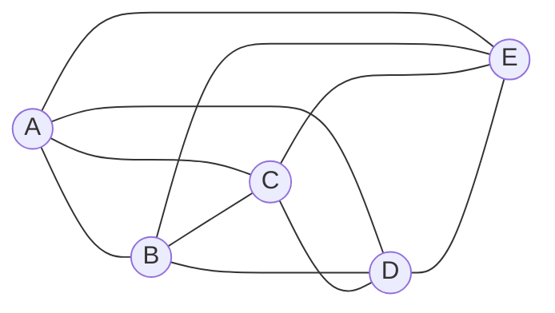
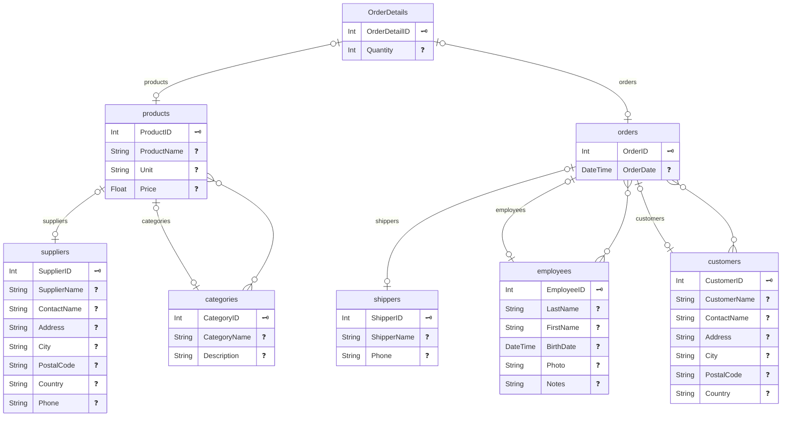
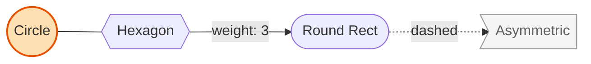
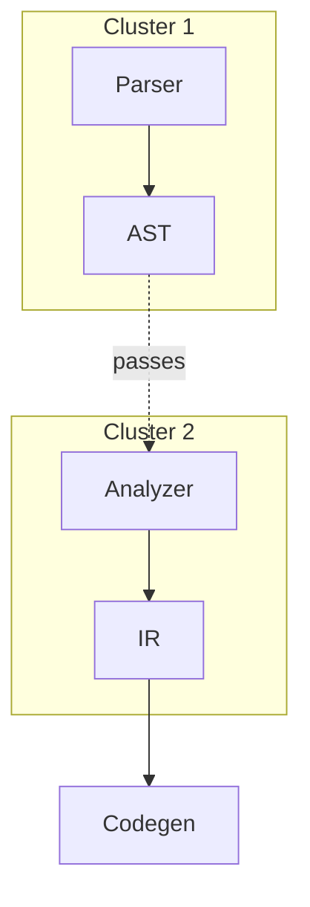
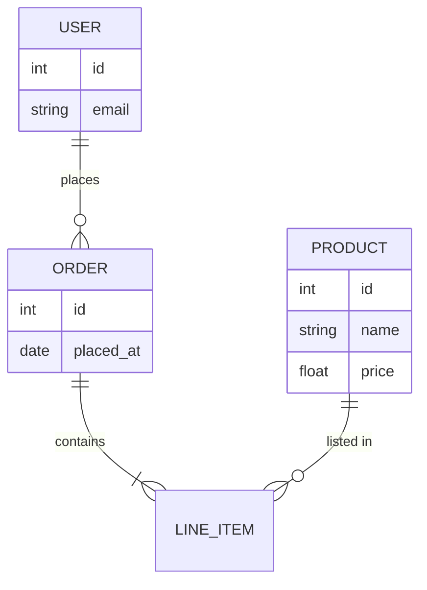

# Example: Graphs in GFM (GitHub Flavored Markdown)

## Mermaid: Undirected Graph



## Mermaid: ER Diagram (Generiert von Prisma)



## Mermaid: Undirected and Styled



## Mermaid: Subgraphs and Links



## Mermaid: ER Diagram (alternative for relationships)



## Fallback: Embed a pre-rendered Graphviz SVG

If you prefer DOT syntax, render locally and commit the SVG.

Example DOT file (`graph.dot`):

```text
digraph G {
  rankdir=LR;
  node [shape=rectangle, style=rounded];
  Start -> "Parse Input";
  "Parse Input" -> "Validate" [label="ok"];
  "Parse Input" -> "Error" [label="fail"];
  "Validate" -> "Execute";
  "Execute" -> End;
  "Error" [shape=ellipse, color=red];
}
```

Render to SVG:

```bash
dot -Tsvg graph.dot -o graph.svg
```

Then reference it in Markdown:


Notes:

- GitHub renders Mermaid blocks directly in `.md` files and PRs.
- Graphviz/DOT does not render on GitHub; pre-render to SVG/PNG.
- Keep diagrams small and focused for readability in README views.
