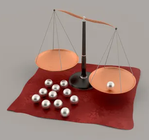

# Zwölf Kugeln und eine Waage drei Mal benutzen

## Angabe

Auf dem Tisch liegen zwölf Kugeln, die optisch voneinander nicht zu
unterscheiden sind. Elf der zwölf Kugeln sind auch exakt gleich schwer. Das
Gewicht einer Kugel weicht jedoch von dem der elf anderen ab. Wir wissen weder,
welche der zwölf Kugeln die Abweichlerin ist, noch ob diese leichter oder
schwerer ist als die übrigen Kugeln.

Sie sollen die Kugel mit abweichender Masse finden und auch ermitteln, ob diese
leichter oder schwerer ist. Dabei dürfen Sie eine Balkenwaage benutzen - aber
nur für drei Wägungen.

## Lösung

Wir legen vier Kugeln in die linke Waagschale und vier in die rechte. Die Waage
kann sich im Gleichgewicht befinden oder nicht. Wir müssen diese beiden Fälle
einzeln betrachten:

### Fall 1: Die Waage ist nicht im Gleichgewicht.

Dann muss die gesuchte Kugel eine der acht sein, die auf der Waage liegen.
Nehmen wir an, die linken vier Kugeln sind zusammen schwerer als die vier
rechts.

Wir nehmen dann drei der vier Kugeln rechts von der Waage, legen sie daneben
(merken uns die drei Kugeln und die auf der Waage verbleibende Kugel!) und
ersetzen sie durch drei der vier Kugeln, die bei der ersten Wägung in der linken
Schale lagen (auch hier merken wir uns die links auf der Waage verbleibende
Kugel). In die Schale links legen wir dann drei der vier Kugeln, die bei der
ersten Wägung nicht dabei waren. Wir wissen, dass diese drei Kugeln keine
abweichende Masse haben können.

Jetzt sind drei Fälle möglich:

#### Fall 1.1: Die linke Seite der Waage ist schwerer.

Entweder ist die links verbliebene Kugel die gesuchte (und schwerer als die
übrigen elf). Oder aber die rechts verbliebene Kugel ist die gesuchte und
leichter als alle anderen. Welcher dieser beiden Fälle zutrifft, finden wir in
einer dritten Wägung heraus, in der wir diese beiden Kugeln miteinander
vergleichen.

#### Fall 1.2: Die Waage befindet sich im Gleichgewicht.

Dann muss die Kugel mit abweichender Masse eine der drei sein, die bei der
ersten Wägung in der rechten Schale lagen. Weil die linke Seite dabei die
schwerere war, steht auch fest, dass die gesuchte Kugel leichter ist als die
übrigen. In der dritten Wägung nehmen wir zwei dieser drei Kugeln und legen sie
in die leeren Waagschalen links und rechts. Ist eine der Kugeln leichter,
handelt es sich um die gesuchte. Sind sie gleich schwer, ist die dritte Kugel
die gesuchte.

#### Fall 1.3: Die rechte Seite der Waage ist schwerer.

Dann muss eine der drei Kugeln, die bei der ersten Wägung in der linken Schale
lag, die gesuchte sein. Wir wissen dann außerdem, dass diese eine Kugel schwerer
ist als die übrigen elf. Wir finden sie, indem wir zwei der drei Kugeln in einer
dritten Wägung miteinander vergleichen. Ist eine schwerer, ist sie die gesuchte.
Sind sie gleich schwer, ist Kugel Nummer drei die gesuchte.

### Fall 2: Die Waage ist bei der ersten Wägung im Gleichgewicht.

Dann muss sich die gesuchte Kugel unter den vier Kugeln befinden, die bei der
ersten Wägung nicht dabei waren. Wir legen drei dieser vier Kugeln in die leere
linke Waagschale, in der rechten Schale liegen drei der acht Kugeln aus Wägung
eins, von denen keine die gesuchte sein kann. Es sind drei Fälle möglich:

#### Fall 2.1: Die linke Seite ist schwerer.

Die gesuchte Kugel ist eine der drei links und sie ist schwerer als die elf
anderen. Durch den Vergleich von zwei der drei Kugeln links miteinander finden
wir die gesuchte Kugel in einer dritten Wägung - siehe die ähnlichen Fälle oben.

#### Fall 2.2: Die rechte Seite ist schwerer.

Die gesuchte Kugel ist dann ebenfalls eine der drei links und sie ist leichter
als die elf anderen. Durch den Vergleich von zwei der drei Kugeln links
miteinander finden wir die gesuchte Kugel in einer dritten Wägung.

#### Fall 2.3: Die Waage ist bei der zweiten Wägung im Gleichgewicht.

Die gesuchte Kugel ist dann jene, die bislang weder bei Wägung eins noch bei
Wägung zwei in einer Waagschale lag. Wir vergleichen sie in der dritten Wägung
mit einer beliebigen anderen Kugel, um herauszufinden, ob sie schwerer oder
leichter ist.
